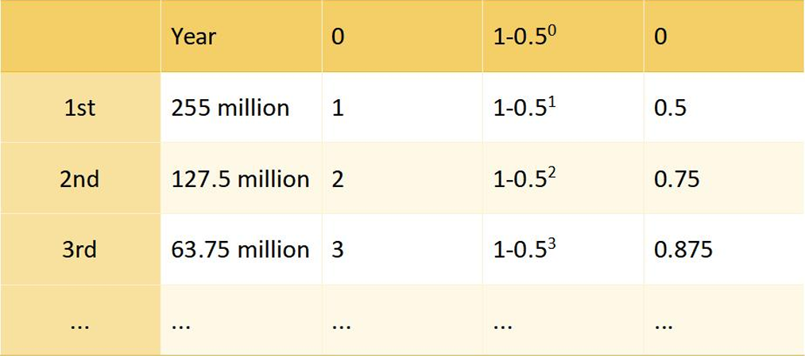

# $AA rewards and distribution

### <u>What is $AA?</u>

 $AA is an ERC-20 token on the Ethereum mainnet, functioning as the governance token for the ArtsArena.io smart contract. It provides governance control over the ArtsArena.io smart contract code, as well as voting and allocation rights for treasury funds.

### <u> What is $AA's maximum supply?</u>

 The maximum supply of $AAis 1,000,000,000 tokens.

### <u>What is the distribution schedule for $AA?</u>

 The community issuance (outside of Liquidity Provider incentives and community reserves) follows a schedule of halving annually, described by the following function: 510,000,000*(1–0.5^year).The purpose of this issuance curve is to favorably incentive early adopters while also maintaining incentives for the long term.

### <u>What are genesis allocation of $AA?</u>

1 billion $BURN tokens would pre-minted in the BURN smart contract,of which...

- 510 million tokens

    -  Placed in the community account

          Locking scheme

          All in circulation, distributed by the airdrop activity in the smart contract.

-  490 million tokens

    -  Placed in the [core team multi-signature account], with 4   multi-signatories

          Locking Scheme

          490 million tokens unlocked annually according to the following schedule: 25% on the 1st year, 25% on the 2nd year, 25% on the 3rd year, and 25% on the 4th year.

          During each unlocking period, the core team adjust the distribution of tokens through multi-signature allocation.

- Our Ethereum deployment address is

  <a href="https://etherscan.io/token/0xb0a0D86BA684e92baC4Afb76be4BCfBe755a2dc7" target="_blank" style="text-decoration: underline;">0xb0a0D86BA684e92baC4Afb76be4BCfBe755a2dc7</a>

  Deployments from any other address should be considered invalid - Do not interact with them.

### <u> How can I earn $AA?</u>

Any action on ArtsArena.io.io can earn you $AA, such as:

- Participating in battles or guess bid

- Sharing ArtsArena.io with friends

- Buying or selling NFT(s) on ArtsArena.io

### <u>Can I buy $AA directly?</u>

Yes, you can buy $AA in the AMM pool on ArtsArena.io.

### <u>What can I do with $AA?</u>

 $AA holders can participate in project governance, including but not limited to gameplay, roadmap adjustments, and treasury fund usage.

### <u>Does $AA have an AIRDROP?</u>

Yes, ArtsArena.io has reserved heavy amount of airdrop tokens for players participating in early blind mining tests. There may even be more than one round of airdrops, so please stay tuned.