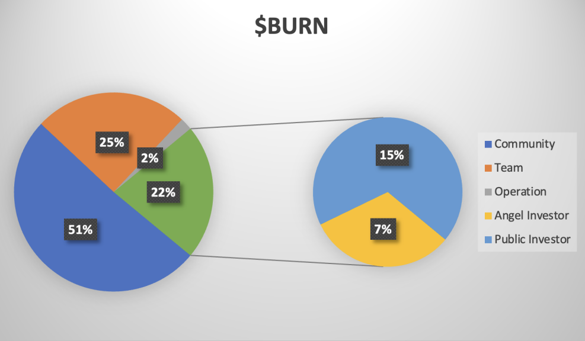

# $BURN rewards and distribution

### What is $BURN？
$BURN is an ERC-20 token on the Ethereum mainnet, functioning as the governance token for the BurnYou smart contract. It provides governance control over the BurnYou smart contract code, as well as voting and allocation rights for treasury funds.

### What is $BURN's maximum supply?
The maximum supply of $BURN is 1,000,000,000 tokens.

### What is the distribution schedule for $BURN?
The community issuance (outside of Liquidity Provider incentives and community reserves) follows a schedule of halving annually, described by the following function: 510,000,000*(1–0.5^year).The purpose of this issuance curve is to favorably incentive early adopters while also maintaining incentives for the long term.

### What are genesis allocation of $BURN?

 10 billion $BURN tokens would pre-minted in the BURN smart contract, of which...
- 5.1 billion tokens
   Placed in the community account.
   **Lockup scheme**
   All in circulation, distributed by the airdrop activity in the smart contract.
- 2.5 billion tokens
   1 billion tokens immediately distributed to the personal wallet accounts of all current team members,1.5 billion tokens placed in the Core team multi-signature account, with 3 signatories.
   **Lockup scheme**
- 2.5 billion tokens
   unlocked with 20% at the 1-year anniversary, 50% at the 2-year anniversary, and 30% at the 3-year anniversary.
   During each unlocking period, the Core team distributes the unlocked tokens through multi-signature allocation.
- 70 million tokens
   30 million tokens placed in early investors' wallet accounts.
   40 million tokens temporarily held in the 【Core team multi-signature account】, 3 individuals discuss and allocate based on contributions from offline investors.
   **Lockup scheme**
- 70 million tokens
   are unlocked over two years, with 40% at the 1-year anniversary and 60% at the 2-year anniversary.
- 150 million tokens
   As the holder in the Core team multi-signature account,placing 150 million $BURN into the 'BURN presale smart contract' for public sale to raise ETH for project development.
   Fully in circulation, with the specific operation principles of the virtual AMM detailed in the following text.
- 20 million tokens
   All placed in the Core team multi-signature account for project operations and promotion.
   **Lockup scheme**
   Fully in circulation,allocated to community supporters with substantial collaboration in accordance with the daily operations of the operating team and project development needs.

Our Ethereum deployment address
is [0xdC8c5206c29296a51cCA5af72db483C04B849E09](https://etherscan.io/token/0xdC8c5206c29296a51cCA5af72db483C04B849E09) since 7th Nov 2023
 Deployments from any other address should be considered invalid - do not interact with them.

### How can I earn $BURN?
Any action on BurnYou.io could earn $BURN.
 Eg
- Participating in battles with your NFTs
- Using magnifier NFT to vote in battles
- Sharing BurnYou.io with friends
- Buying or selling NFTs on BurnYou
- Bid and collect NFTs on BurnYou

### Can I buy $BURN directly?
Yes, you could buy $BURN in the AMM pool on BurnYou.io.

### What can I do with $BURN?
$BURN holders can participate in project governance, including but not limited to adjustments to battle gameplay, roadmap, fee changes, and the use of treasury funds, and more.

### Does $BURN have an AIRDROP?
Yes, BurnYou has planed a portion of AIRDROP tokens for players who participated early in blind mining tests. There might be even more than one run of AIRDROP, so stay tuned.