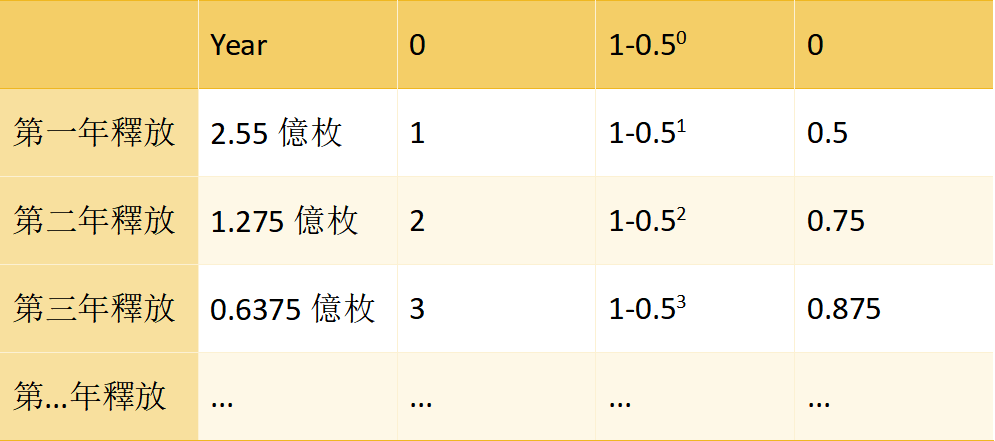

# $AA 獎勵與分配

### <u>什麼是$AA？</u>

 $AA 是基於以太坊主網發行的ERC20代幣，同時是ArtsArena.io智能合約的治理代幣，對ArtsArena.io智能合約代碼擁有治理權，並擁有該智能合約國庫資金的投票權和撥款權。

### <u>$AA 的最大供應量是多少？</u>

 $AA 的最大供應量為1,000,000,000個代幣（10億枚）

### <u>$AA 的配發時間表是什麼？</u>

社區發行（在LP激勵和社區儲備之外）遵循每年減半的時間表，由以下函數描述：510,000,000*(1–0.5^year)。 設定這條發行曲線的目的是有力地激勵早期採用者，同時保持一定的長期激勵。

### <u>$AA 的創世分配是什麼？</u>

10 億枚$AA代幣在AA智能合約提前鑄造，其中

- 5.1億枚

    - 放入Community 帳戶

        鎖定方案

        全流通，智能合約以空投活動分配

-  4.9億枚

    - 放入【Core團隊多簽帳號】，4人多簽

        鎖定方案

        4.9 億枚按上線1週年25%、2週年25%，3週年25%,4週年25%逐年解鎖

        每年解鎖期，Core團隊對此期流通代幣進行多簽分配

- 我們的以太坊部署地址是

  <a href="https://etherscan.io/token/0xb0a0D86BA684e92baC4Afb76be4BCfBe755a2dc7" target="_blank" style="text-decoration: underline;">0xb0a0D86BA684e92baC4Afb76be4BCfBe755a2dc7</a>

  來自任何其他地址的部署都應被視為無效- 不要 與它們互動。

### <u>我該如何賺取$AA？</u>

任何使用ArtsArena.io的動作都能賺取$AA

- 參與對抗或競猜

- 分享ArtsArena.io給朋友

- 在ArtsArena.io上購買或賣出NFT

### <u>那可以直接購買$AA嗎？</u>

可以，在ArtsArena.io上的AMM池中購買。

### <u>我可以用$AA做什麼？</u>

 $AA 持有者可以參與專案的治理，包括但不限於各類玩法、路線圖、手續費的調整、國庫資金使用用途等等。

### <u>$AA 有空投嗎？</u>

有，ArtsArena.io有預留一部分空投代幣用於早期參與盲挖測試的玩家甚至是還不只一期空投，請您期待。